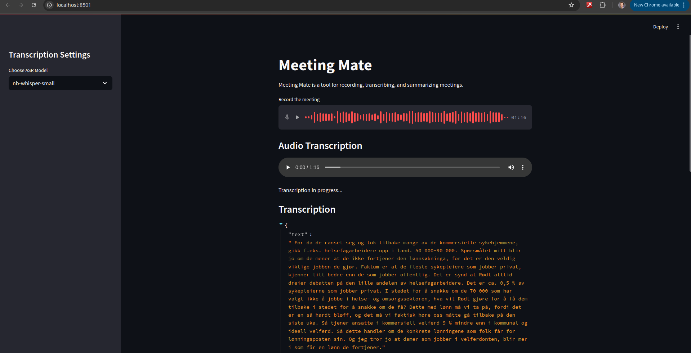

# Meeting Mate
Meeting Mate is a local tool for transcribing and summarizing meeting audio. It leverages cutting-edge Automatic Speech Recognition (ASR) models from NbAiLabBeta – fine-tuned versions of OpenAI's Whisper – alongside the Hugging Face Transformers library for transcription. Additionally, it utilizes Mistral and Ollama to generate concise meeting summaries.

**Key Features:**
- **Local Processing:** Runs entirely on your machine with no need for an internet connection after initial setup.
- **Multiple Interfaces:** Offers both web and desktop GUI options
- **Efficient Summaries:** Summarizes long meetings



## Pre-requisites
Before getting started, ensure that you have the following installed:

- **Ollama and Mistral:**  
  Download from [Ollama](https://ollama.com/download).  
  For Linux, you can install Ollama by running:
  ```bash
  curl -fsSL https://ollama.com/install.sh | sh
    ```
  Then download the Mistral model by running:
  ```bash
    ollama pull mistral
  ```
  This will download a 4GB model.

- Install the required Python packages:
  Recommended to create a virtual environment before installing the packages.
  ```bash
  pip install -r requirements.txt
  ```

## Usage
One can use one of two gui interfaces to interact. Either the web interface or the desktop interface.

To run the web interface, run the following command:
```bash
streamlit run streamlit_gui.py
```
or using docker-compose:
```bash
docker compose up --build
```

Once started, access the web interface by navigating to http://localhost:8501 in your browser.


To run the desktop interface, run the following command:
```bash
python tk_gui.py
```